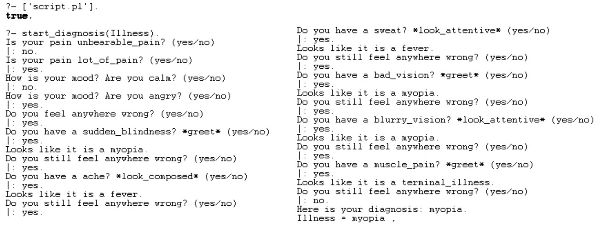

# CZ3005---doctor-chatbot

### Assignment Q4 Patient with a sympathetic doctor
Assume that the prolog script is a sympathetic doctor, conversing with a patient who can answer only yes or no. The doctor should be able to diagnose the patient’s condition while asking question sensitively depending upon patient’s pain level and mood level. You can choose 5 or more different mood considerations (calm, angry, etc.) and 5 or more levels of pain. Five or more diseases should be diagnosable, each disease characterized by 5 or more symptoms.

### My solutions
For this assignment, I have developed two type of solutions.

#### 1. interactive prolog doctor chatbot
I attempted to create an interactive doctor chatbot using `node.js` which integrates in `SWI-Prolog` via the `swipl` node module. The following shows a sample interface of the program.

[link to interactive prolog doctor](interactive_prolog_doctor/README.md | width=100)

#### 2. pure prolog doctor chatbot
I attempted to create an doctor chatbot purely using prolog. The following shows a sample execution of the program.

[link to pure prolog doctor](pure_prolog_doctor/README.md)

